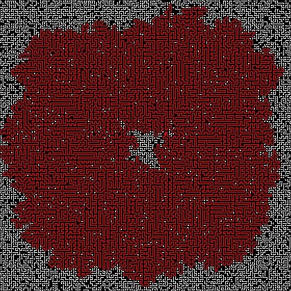

# [Advent Of Code 2023](https://adventofcode.com/2023)

This repository is here for myself, 
my daughter who needs to learn Python but hates CS.

My goal is to write "clean code" with documentation.
This goal will not be reached, but who cares?

If you are reading this, and it helped you, good!

The text files are for my account only : it will not work
for you.

If you want to test with your own data, clone this repo and
replace the .txt files by the ones provided by AOC.

Lets dive in with [day 1](day01/day1.py)

My maze of day 10, the start point is red dot near the center
the red part is the connected pipe network. In white the random 
pipes used for padding.

